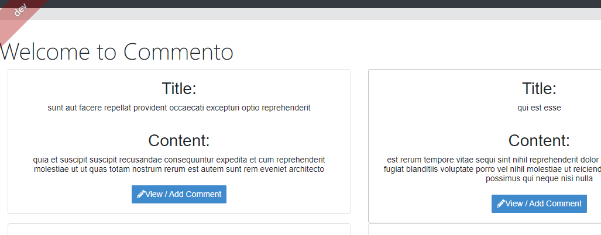
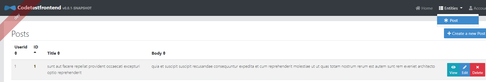
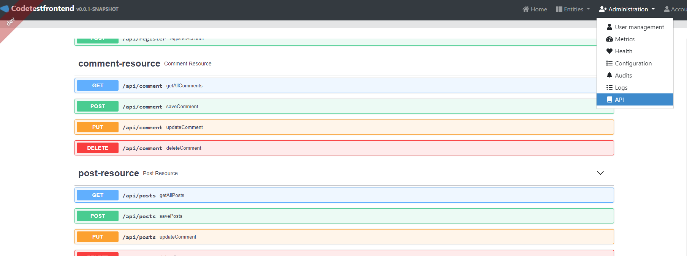

# Commento 
This is a simple applcation which pulls the information from https://jsonplaceholder.typicode.com/ using its REST API 
https://jsonplaceholder.typicode.com/posts
https://jsonplaceholder.typicode.com/comments

Application consists of 2 parts 
1. Backend: This is being created as a microservice and all its code is under commentobackend folder 
2. Frontend: This service contains all the frontend code which is under commentofrontend folder 


## Usage 
1. Anomynous user can see all posts in login screen and view and add comments 


2. Normal user can login into application and add new posts 


3. Admin user can login into application and add new posts and see system level details of application



## Prerequites 
To Run this application, You need to have java 8 , node.js 12 or above and yarn 1.16.0 or above installed locally 
As docker work is still in progress so user can optionally install docker engine locally 

## How to run

### Backend 
```
cd commentobackend
```
```
./gradlew
or
gradlew.bat
```
### Frontend 
```
cd commentofrontend
```
```
yarn
yarn start

or 

npm install
npm start
```

### Important Links 

Application frontend will be available on [http://localhost:9000](http://localhost:9000) in your browser.
Application backend will be available on [http://localhost:8080](http://localhost:8080) in your browser.

Default login is 
```
admin/admin 
and 
user/user
```


### DB Console 
DB Console will  be available on [http://localhost:9000/h2-console](http://localhost:9000/h2-console) in your browser.

### Swagger UI 
Swagger UI is available on [http://localhost:9000/admin/docs](http://localhost:9000/admin/docs) in your browser, login as admin


